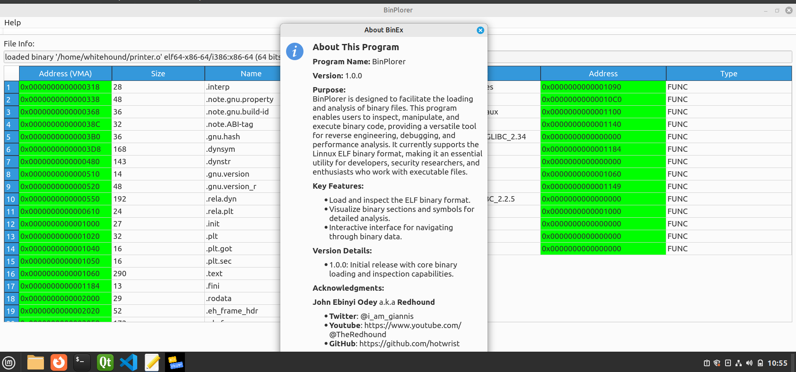

# BinPlorer
This is the repository for BinPlorer, a GUI binary loader.
BinPlorer is designed to facilitate the loading and analysis of binary files.
This program enables users to inspect binary codes or files providing a versatile tool for reverse engineering, and debugging.
It currently supports the Linux ELF binary format, making it an essential utility for developers, security researchers, and enthusiasts who work with executable files.
In the future, i am hoping to add to the capability of this tool to enable it handle Windows PE files.

# Key Features:
  + Load and inspect the ELF binary format.
  + Visualize binary sections and symbols for detailed analysis.
  + Interactive interface for navigating through binary data.

# Version Details: 1.0.0: 
  + Initial release with core binary loading and inspection capabilities.

# Acknowledgments:
  * John Ebinyi Odey a.k.a Redhound, Whitehound, Hotwrist

# Requirements (Qt C++ Framework & libbfd)
Make sure you have both Qt C++ Framework and libbfd installed on your system.

# BinPlorer Logo

# BinPlorer Interface

